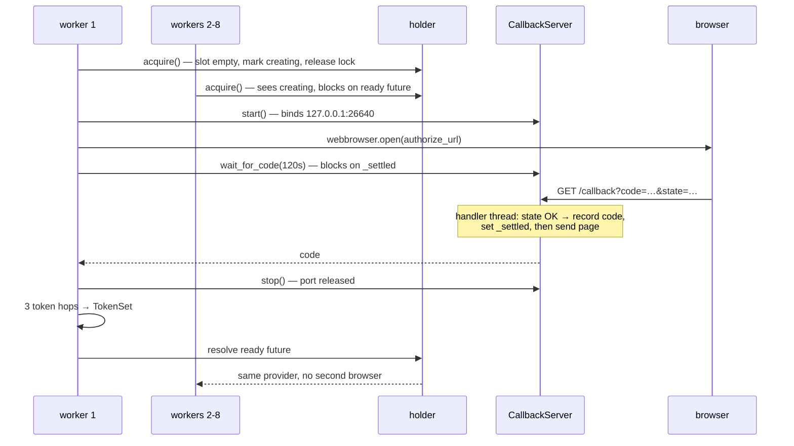

# Concurrent OAuth login: locking and inter-thread coordination

How the interactive-OAuth path behaves when several threads / `Connection`s try to authenticate at
once — the locks, the events, and the part the loopback web server plays.

## TL;DR

The first of N concurrent threads through creates the web server and drives the browser flow; the
other N−1 block on its outcome. When that flow finalizes — success, error, or timeout — the web
server is torn down and all N resolve to the same outcome. Failure clears the slot, so a later
`connect()` starts fresh rather than inheriting it.

## Status of each layer

Every layer below is code today except the last, which is designed (epic #150) but unbuilt --
everything about it describes intent, not observed behavior.

| Layer | Owns | State |
| --- | --- | --- |
| `CallbackServer` (`oauth/callback_server.py`) | one login attempt's redirect capture | **built** (#152) |
| `CCloudOAuth` provider (`oauth/provider.py`) | the shared `TokenSet`, refresh single-flight, `reauthenticate()` | **built** (#153, #156) |
| `ProcessOAuthHolder` (`oauth/holder.py`) | one login + one provider per process, `reauthenticate()` delegation | **built** (#154, #156) |
| Refresh daemon, refcount/park | latency optimization | designed, #157 |

## Why it works that way

**Concurrent logins are prevented, not merged.** Exactly one thread performs the browser login;
every other thread blocks on its outcome and then shares the resulting tokens. This is not a
politeness feature — it is forced by the web server. The callback port is baked into the auth service's
client's whitelisted `redirect_uri`, so **two logins physically cannot run at once in one process**:
the second `CallbackServer.start()` fails with `OAuthLoginError(PORT_IN_USE)`. The holder's
login single-flight (#154) exists precisely so that failure is never reachable through normal use.

Past login, concurrency is real and continuous: httpx invokes our `auth_flow` on whatever caller
thread is making a request, with no serialization of its own. Two provider-owned locks handle it.

## Layer 1 — the callback server (built)

One `CallbackServer` instance serves one login attempt, matching the single-use authorization code
it exists to capture. Three kinds of thread meet inside it:

| Thread | Role |
| --- | --- |
| the `connect()` / login thread | calls `start()`, blocks in `wait_for_code(timeout=120.0)`, calls `stop()` |
| the serving thread (`_serve`) | runs `serve_forever(poll_interval=0.05)`; a daemon thread |
| one handler thread per request | `ThreadingHTTPServer` spawns these; they run `do_GET` |

Coordination between them is deliberately minimal — a `threading.Event` plus a first-write-wins
outcome slot under a `threading.Lock`:

- **`_settled: Event`** — the only thing the waiter blocks on. Set exactly once, when an outcome is
  recorded. `wait_for_code` blocks on it rather than polling (unlike the driver's server-side
  lifecycle waits, the condition is signalled in-process, so there is nothing to poll).
- **`_lock` + `_code` / `_failure`** — a handler thread writes the outcome; the write is dropped if
  the event is already set. That makes a reloaded success page (which re-delivers the same redirect)
  unable to replace the code its PKCE verifier was minted alongside.
- **Only two outcomes resolve the wait**: a state-matching redirect carrying a `code`, or a
  state-matching redirect carrying an `error`. Every other request — wrong `state`, missing `code`,
  unknown path — gets a 4xx page and **leaves the login pending**. Anything on the box can GET a
  loopback port, so a stray or hostile request must not be able to cancel a login whose genuine
  redirect is still in flight. Rejections are logged (`warning`, except unknown-path at `debug`)
  precisely so a login hanging for this reason is diagnosable.
- **`stop()`** is what releases the port: `shutdown()` only if the serving thread is still alive
  (`serve_forever` sets the event it waits on as it unwinds), then `server_close()`, then a bounded
  join. The tight 50ms poll interval is partly about this — a slow teardown widens the window in
  which the *next* attempt would hit `PORT_IN_USE` against our own not-yet-released port.

**Cross-attempt interference is handled by `state`, not by the port.** Each attempt generates its
own `state` and hands it to its own `CallbackServer`. A stale browser tab replaying an earlier
attempt's redirect against a freshly-bound listener mismatches, gets a 400, and the pending login
keeps waiting.

## Layer 2 — the holder's login single-flight (#154, built)

N threads calling `connect(auth="oauth")` at t=0 must produce **one** browser bounce and **one**
port bind. The design:

1. First thread to reach the auth stage takes the module lock, finds the slot empty, marks it
   *creating*, and **releases the lock**.
2. It runs `login()` — `CallbackServer.start()` → `webbrowser.open()` → `wait_for_code()` → the
   three token hops. This can take minutes of human time.
3. Every other thread takes the module lock, sees *creating*, and blocks on a one-shot ready future
   rather than the lock itself.
4. Winner resolves the future; waiters wake and share the same provider. On failure the slot is
   cleared so a later `connect()` can retry with a fresh browser.

The load-bearing detail is step 2's release: **the module lock must never be held across the browser
round-trip.** Holding it would serialize every waiter behind a multi-minute human action while
holding a lock other holder operations need.

Two guarantees fall out. The obvious one is UX — dbt in multi-threaded mode opens one `Connection`
per worker and the user sees the browser once. The less obvious one is that the fixed callback port
never becomes a failure mode: only the winner ever calls `CallbackServer.start()`.

There is also a **one-identity guard**: one browser session means one `(environment, user, org)`. A
later OAuth `connect()` naming a *different* environment (`config`) or a *different*
`organization_id` raises `InterfaceError` rather than borrowing a token minted for the wrong
Confluent Cloud or the wrong org; one that omits the org inherits whatever the first login
established. The environment axis matters because a differing `config` means a different issuer, API
host, and client — silently returning the established provider would hand the connection
wrong-environment credentials.

## Layer 3 — the provider's two locks (#153, built; reauthenticate() joins the same gate, #156)

Past login, every request stamps a header from the shared `TokenSet`. `httpx.Auth.sync_auth_flow`
does no locking of its own — it just defers to `auth_flow` — so our `auth_flow` runs **concurrently
across threads with zero serialization**. Hence two locks with sharply different hold times:

- **`_token_lock` — held for microseconds.** Guards the *reference slot* and the failure flag. Two
  operations only: read the current `TokenSet` reference, or atomically rebind it to a freshly built
  one. Never held across network I/O. Because a `TokenSet` is an immutable snapshot, a reader that
  has copied the reference can read its fields lock-free, and no torn read is possible — refresh
  builds a new snapshot rather than mutating one.
- **`_refresh_lock` — held for microseconds, guarding the in-flight `Future` slot.** The
  single-flight gate is the **`Future`**, not the lock: one caller wins and runs the chain outside
  every lock, and everyone arriving meanwhile joins that same `Future`, receiving the winner's
  snapshot or having the winner's exception re-raised on their own thread. Before starting a
  flight, a caller whose snapshot was already superseded by a **completed** refresh gets that
  result handed straight back.
- **`_login_lock`** — the only lock held across I/O, and only by `login()`, whose browser
  round-trip can take minutes. Deliberately not the refresh gate, so the request path never queues
  behind a human.

**The auth service's refresh tokens are single-use and rotating**, so two threads both spending the
same one means a hard lockout. What prevents that is that the chain reads the token it will spend
out of the slot *at the moment it runs*, never out of the snapshot its caller arrived holding. A
waiter therefore spends the current token or none, whatever it queued with.

**`reauthenticate()` (#156) is a second producer into the same `_inflight_refresh` slot**, not a
gate of its own. Once a caller reaches it, `self._failure` is already latched (a plain `_refresh()`
never even reaches the slot once that's set -- the check happens first), so the slot is always
free for `reauthenticate()`'s winner to claim; the winner runs a fresh interactive login instead of
the refresh chain and installs its `TokenSet` under the very same `_token_lock` critical section.
Sharing the slot rather than adding an independent one is what rules out a late-finishing plain
refresh racing a reauthentication to install `_token_set` -- the refresh's rotated-but-derived-from
-a-stale-refresh-token result overwriting a just-completed fresh login. Everything above about the
`Future`, the double-check, and the two-locations failure check applies unchanged; `reauthenticate()`
only changes *which chain* the winner runs.

### Why a `Future` and not a lock

#153 first built this gate as a lock held across the chain, with waiters double-checking the slot
on wake-up. Two defects in a row came from that shape, and both trace to the same root: **a lock
only says "you may proceed", so a waking thread has to reconstruct the outcome by re-reading shared
mutable state.**

1. A waiter could misread the mid-chain checkpoint — persist-before-exchange publishes the rotated
   refresh token alongside the *old* CP/DP tokens — as somebody's finished refresh, and be handed
   back the very tokens it came to replace (caught reviewing #182).
2. A *failed* attempt taught the waiters nothing, so each ran its own chain. Measured: eight
   waiters against one outage produced **eight** rotations and eight `/api/sessions` attempts.
   Against the service's ~50-refresh cap that is a path to the very lockout the gate exists to
   prevent.

A `Future` carries in-flight-ness, success, *and* failure in one object, so waiters learn all
three instead of re-deriving them. Same scenario after the change: **one** rotation, one attempt,
and all eight waiters raising the winner's own exception object. It is also the idiom #154 already
mandates for the login single-flight — worth keeping the two consistent.

`_interim_snapshot` survives the change, for the narrower job of the pre-flight fast path: a caller
whose snapshot was superseded skips starting a chain, and that check must recognise a *completed*
refresh rather than a checkpoint left behind by a failed one.

The failure flag is checked in **two** places, and both are load-bearing: in the request path's
microsecond critical section (the fast path — a session already known dead never starts a flight),
and again when entering a flight. The second covers the race where a thread reads a healthy
snapshot, finds its token stale, and reaches the gate just as another thread latches the failure.

The upshot for a shared `Connection`: the driver declares `threadsafety = 1` and OAuth doesn't
change that — the weak link is the `Connection`'s own per-statement/cursor state. But **auth is not
what breaks** under a shared `Connection`, and that is what these locks buy.

## Timeline: 8 dbt workers connect at once

Workers 2–8 never touch the port, never open a browser, and never run the token chain. Roughly
five minutes later, when the ~5-minute CP token lapses and several workers issue requests at once,
they all enter `_refresh()`, one wins the flight, the rest join its `Future` and take its result —
one chain run, one refresh-token spend. Had it failed instead, they would share that one failure
too, rather than each running a chain of their own.

## Where the fixed port still bites

- **Across processes, nothing coordinates.** Two Python programs logging in simultaneously — or one
  of them alongside a live mcp-confluent session, which currently shares the borrowed port — collide
  on 26640, and the loser gets `PORT_IN_USE`. No in-process holder can fix that. mcp-confluent hit
  the same wall in its own test suite and resorted to a PID lock file in `tmpdir()`
  (`tests/harness/oauth-port-lock.ts`) to serialize forks. Our own #177 (getting a dedicated client
  registration) removes the *collision with mcp-confluent* but not the general case.
- **An abandoned login holds the port for up to `DEFAULT_LOGIN_TIMEOUT_SECS` (120s).** The user who
  closes the browser tab without completing consent leaves the listener bound until the timeout
  expires and `stop()` runs. `PORT_IN_USE` names this as the likely cause.
- **Re-auth at the 8h wall reuses the same port.** `CCloudOAuth.reauthenticate()` (#156) routes
  through `_refresh()`'s own `_inflight_refresh` / `_refresh_lock` gate rather than a gate of its
  own — see "Layer 3", below — so N threads hitting the wall together still collapse to one
  browser bounce rather than a burst of `PORT_IN_USE` failures. `ProcessOAuthHolder.reauthenticate()`
  is a thin delegation on top: the provider's gate is what actually does the collapsing.

## Invariants worth pinning in #153 / #154 / #156 tests

Items 3 and 5 are #153's, covered by `tests/unit/oauth/test_provider_unit.py`; items 1, 2, 4, 6,
and 7 are #154's, covered by `tests/unit/oauth/test_holder_unit.py`. That suite drives the holder
against a lightweight `FakeProvider` injected through `acquire()`'s `provider_factory` seam, whose
`login()` a test can gate open, block, or fail — so the coordination is exercised without a real
browser or socket. Only the single-flight *winner* ever builds a provider, so "one built provider"
is the single-flight property stated as a fact about construction.

1. ✅ N concurrent OAuth `connect()`s → login fires **once**; all N share one provider.
   *Pinned by `test_concurrent_acquires_log_in_once_and_share_one_provider`: the winner is parked
   inside a gated `login()` so the rest must join its `Future` (the join path), not each read a
   stored provider after the winner already finished — the same "make the winner measurably slow"
   trap as the #153 refresh tests.*
2. ✅ Login failure clears the holder slot; a later `connect()` retries with a fresh browser.
   *`test_login_failure_clears_the_slot_so_a_later_acquire_retries`, plus
   `test_concurrent_waiters_share_one_failed_login` for the fan-out: one attempt, every waiter
   handed the winner's actual exception object.*
3. ✅ Two threads hitting a stale token concurrently → refresh chain runs **once** (assert the mock
   was hit once), and the refresh token is spent once. A *failed* chain likewise costs one attempt
   shared by every waiter, not one apiece.
   *Pinned by `test_concurrent_refreshes_of_one_stale_snapshot_run_the_chain_once` and
   `test_concurrent_waiters_share_one_failed_attempt`. Two traps, both learned the hard way:
   drive these at `_refresh()` rather than through the request path, since routed through httpx
   the losers re-read the slot and find a fresh token before ever reaching the gate (the first
   version of the test survived deleting the gate's short-circuit entirely); and make the chain
   take measurable time, since `MockTransport` answers instantly and the winner would otherwise
   finish before any other thread arrives, leaving nothing concurrent to observe.*
4. ✅ The module lock is not held across `login()`.
   *`test_the_module_lock_is_free_while_a_login_is_in_flight` observes it behaviorally: with the
   winner parked inside a gated `login()`, a `shutdown()` on another thread — which needs that same
   lock — completes promptly rather than blocking until the browser returns. `shutdown()` cannot
   abort an in-flight login (the fixed callback port means only one login may run at a time), so
   the winner's login is left to settle and installs normally rather than being discarded;
   `test_shutdown_during_a_login_does_not_let_a_new_acquire_start_a_second_login` pins that a
   concurrent `acquire()` joins that same in-flight login instead of starting a competing one.*
5. ✅ `data_plane_auth` and `control_plane_auth` stamp **different** tokens from the same snapshot.
6. ✅ A second `connect()` naming a different environment (`config`) or `organization_id` raises
   `InterfaceError`. *`test_a_second_environment_is_refused` and `test_a_second_organization_is_refused`
   for the sequential cases; `test_a_joiner_wanting_a_different_org_is_refused_while_the_winner_succeeds`
   for the race — the guard runs per-caller after obtaining the shared provider, so a joiner who
   disagreed on environment or org is refused without disturbing the shared login.*
7. ✅ Tests reset the module holder between cases — a leaked provider (and, later, daemon) across
   cases is the failure this guards. *The autouse `_reset_holder` fixture calls `shutdown_all()`
   around every case.*
8. ✅ N concurrent `reauthenticate()` calls at the wall → one fresh login, shared by every caller
   (success or failure alike), and the absolute wall is reset from the fresh login's own mint time
   rather than carried forward. *Pinned in `test_provider_unit.py::TestReauthenticate`:
   `test_concurrent_reauthenticates_collapse_to_one_login` (the join path, same "make the winner
   measurably slow" trap as items 1 and 3) and
   `test_a_joiner_receives_the_winners_reauthentication_failure` (the shared-failure fan-out, same
   trap as item 2/#153's failed-refresh case). `holder.reauthenticate()`'s own module-lock-not-held
   property is pinned separately in `test_holder_unit.py::TestReauthenticate::
   test_the_module_lock_is_free_while_reauthenticate_is_in_flight`, mirroring item 4.*

#153 additionally pins, beyond the list above: the rotated refresh token is persisted **before**
the CP/DP legs (and survives a mid-chain failure, so a crash there is one lost request rather than
a lockout); a refresh does **not** move the 8h absolute wall; a `403 invalid_grant` latches
`ReauthenticationRequired` while a `503` leaves the session recoverable; a `401` forces exactly one
refresh and one retry; and the callback port is released after a successful login.
